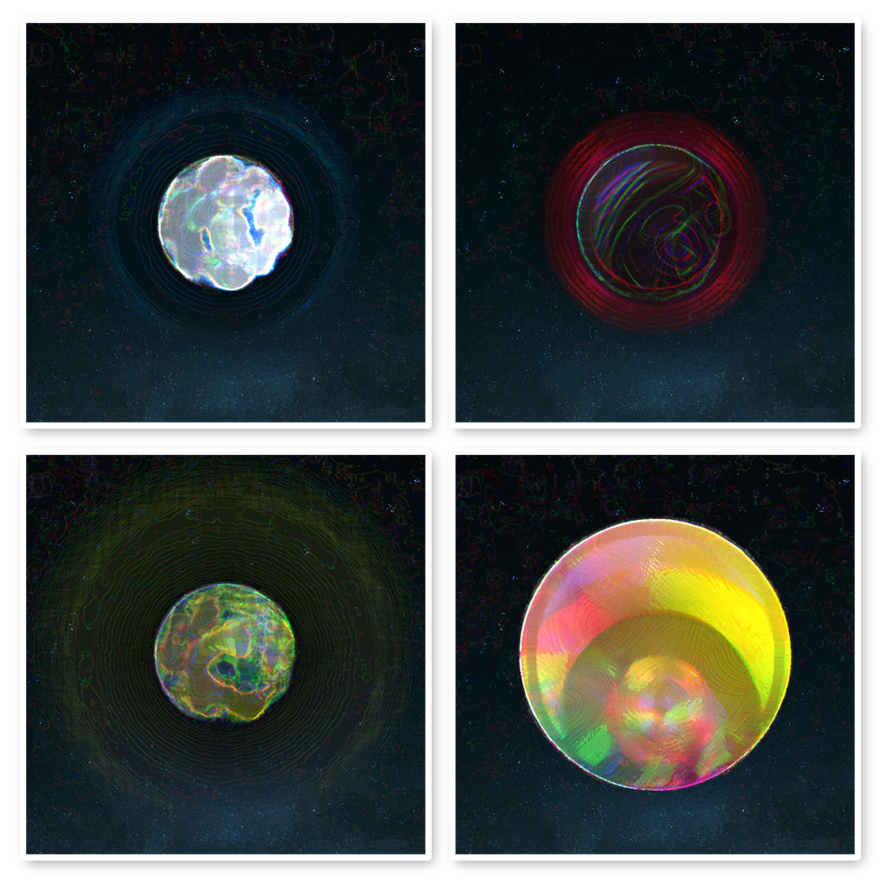

# Zilliverse spheres

Zilliverse spheres is a collection of 150 procedurally generated planets that will eventually be minted as NFTs.
These code generated planets represents the world outsede of our solar system. And each of them are different fron each other, in inclusion to that every planet has its unique name as well. These names are randomly generated from a combination of 26 aplhabets and numbers from 0-9.

This particular NFT collection is an extention to one of my previous work.
You can find the code for this project in my other [**repository.**](https://github.com/masket-bask/planet-gen)

### A couple examples: 

### Overview of techniques used
The images are generated by a script written in Javascript; the main libraries used are node-canvas and Jimp for the actual image generation and tumult for the noise.

The planets are more or less just an amalgamation of gradients masked on top of eachother which gives them a 3D look, even though they are just 2D images drawn on a canvas.

There is a lot of randomness and noise used for a plethora of parameters.

The script firstly generates a random name for each planet which is then used as a seed for the actual planet generation.

## The Gallery
Feel free to check out [The Gallery](./gallery/readme.md) where you can scroll through all 150 planets and see them in all their glory.
